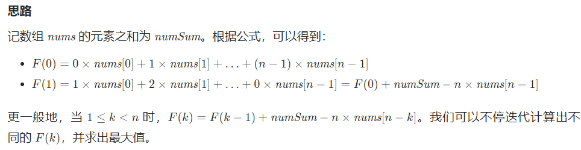

# 1. 最长的递增子区间

dp，$dp[i]=dp[i-1]+1 \quad if \quad arr[i]>arr[i-1]  \quad or \quad 1$

# 2. 最长的各值为k的子区间

与1相同，都是通过dp，连续

# 3. 最长的区间和为k的子区间

**或者问的是满足这样子区间的个数**

也就是说，找到序列中一个最长的子区间，其区间和为给定值。

$O(n)$做法为，先前缀和处理一下序列，之后对于访问到的每个$preSum[i]$, 我们查询$map$里是否有 key : $preSum[i]-k$ , value = index的。维护一个max记录两个index的差值就行。

# 4. 最长的区间和模k=0的子区间

https://www.luogu.com.cn/problem/P3131

关键在于$a-b\ \ mod\ \  7 ==0$，那么$a\ mod \ 7 == b\ mod \ 7$.

于是我们求前缀和的时候，模7.之后枚举0~6，看两个0、1...的之间的最长距离，维护max。

# 5. 非连续的最长递增子序列

【https://www.luogu.com.cn/problem/P1020】

1. $O(n^2)$做法 dp

dp[i]维护的是以i结束的，符合条件的非连续递增子序列长度。

而我们遍历arr[i]时，就要依次找到前所有<arr[i]的所有k对应dp[k]中的最大值，然后+1.

2. $O(nlogn)$做法 贪心+二分

维护一个单调递增数组，该数组的贪心策略是让数尽可能小。

访问当前arr[i]，若其>数组的尾，则push_back，否则将其替换为数组中大于它且最接近它的值。
【二分查找的时候要格外注意，如果我们要维护的是严格递增，那么判断的时候要是<=或者>=，否则有可能会出现维护的数组不是严格递增】

最后得到的数组不一定是我们要的序列，但是长度一定为我们要的长度。

证明：如果替换完之后，之后再遇到大于该值的递增，会逐步替换。

如果没有，那么序列的总长度也不会变。

# 6. 如何让子区间各值削平

https://www.luogu.com.cn/problem/P4552

只能对某一区间+1或-1，要求该操作次数最少。

先差分，然后就要让这些差分值都变成0.

注意从i=2开始.

先找到负的+1，正的-1，这算是一个操作。

X是差分后所有+的和，Y是差分后所有Y的和的绝对值

直到只剩下1个正或1个负： 0 0 0 0 X-Y

两种操作，一种是让前面的原数组都加X-Y，第二种是让后面的减去X-Y，最终得到的次数都是 max(X,Y).

X是差分中正值和,Y为负值和的abs.

最少次数下，有几种最终结果，只有最后0000X-Y做贡献，可以改变0~X-Y次，后面的值对应改变X-Y~0次，所以结果是|X-Y|+1.

# 7. 最长的∩型非连续序列长度

L[i]维护以i结束的，非连续递增序列长度

R[i]维护以i开始的，非连续递减序列长度

L[i]+R[i]-1即为所求

P1091

# 8. 求最长的递增/递减非连续序列，且最少几个序列能覆盖所有

https://www.luogu.com.cn/problem/P1020

前一问是求递增，后者是求递减。【非连续序列的长度】

每次求一个递增非连续，并把这些序列元素抛弃掉。那么剩下的第一个元素一定比我的小，重复。所以可以化模拟为直接结论。

# 9. 最长公共序列与最长公共子串

连续与不连续表现在dp上的最大特点是,$dp[i][j]$在连续时表现为以 i j结尾的；在非连续时表示前i个与前j个

## 9.1 LCS：最长公共序列

用于描述两个序列的相似程度

特点是不要求连续

使用$dp[i][j]$ 来表示序列A的前i个字符与序列B的前j个字符的最长公共序列长度。

$$dp[i][j] = dp[i-1][j-1]+1, \quad if A[i]==B[j]$$

$$dp[i][j] = max(dp[i-1][j],dp[i][j-1]),\quad if A[i]\neq B[i]$$

若i\==0 or j==0 : $ dp[i][j] = 0$

## 9.2 最长公共子串

和LCS的区别在于，dp\[i]\[j]代表必须以A[i]与B[j]结尾，如果二者不同那么直接置零。

# 10. 旋转函数

给定一个长度为 n 的整数数组 nums 。

假设 arrk 是数组 nums 顺时针旋转 k 个位置后的数组，我们定义 nums 的 旋转函数  F 为：

F(k) = k * arr[0] + (k+1) * arrk[1] + ... + 1 * arr[n - 2] + 0 * arr[n-1]
返回 F(0), F(1), ..., F(n-1)中的最大值 。

# 11. 左/右第一个大于/小于 a[i]的数

单调栈：给定一个序列，能够以O(n)的时间复杂度找到所有元素的、其左或右的第一个大于等于小于等于的元素.

# 12. 最长序列. 左边最小，右边最大. 中间处于二者之间

可以转化为，找到这样一个序列：

* 对于左端点，在右边第一个<=他的值应当在右端点的右侧
* 对于右端点，在左边第一个>=他的值应当在左端点的左侧

利用单调栈预处理掉各点的左右两个第一个点，之后枚举端点来判断.

P6510 奶牛排队.

# 13. 最大子序列

* 若规定了子序列的长度 k ，那么就是前缀和后, preSum[i] - preSum[i-k]
* 若未规定子序列长度，则用dp[i]代表以a[i]结尾的最大长度. 有 dp[i] = max(dp[i-1]+a[i], a[i])
* 若规定了子序列的长度**小于等于k**
  * 朴素做法是先前缀和预处理，然后枚举端点，对其前K个做判断.
  * 单调队列优化，$ans = max(ans, preSum[i]-preSum[j]),  i-k+1<j<i$    我们要维护一个最小的preSum[j]，每次直接减去就可以了。**实际上，这就是单调队列维护区间最小值的应用.**