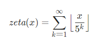

# M1 阶乘后的0

给定一个整数 `n` ，返回 `n!` 结果中尾随零的数量。

每个0都是由10=2×5得到的，将阶乘的式子分解成最小质因子的乘法，我们易知5的个数小于2，因此我们的思路是

找10的个数->找5×2的个数->5的个数小于2，只用找5的个数



zeta(x)代表了x!的后面0个数.   我们先扫一遍5的倍数，又由于25 50都有2个5，因此再扫一遍就是找 [x/25]的个数. 一直下去.

且我们只需要x/5就可以模拟分母乘以5

```cpp
class Solution {
public:
    int trailingZeroes(int n) {
        int ans = 0;
        while (n) {
            n /= 5;
            ans += n;
        }
        return ans;
    }
};
```


* **变体：**给定一个尾数为0的个数k，求有多少x，满足x!的尾数有k个0
  * 根据zeta(x)可知，x x+1 x+2 x+3 x+4的值应当是相同的，之后会多一个0.
  * 所以对于给定k, 要么是0个x，要么是5个x.
  * 二分查找，下界是0，上界是5k.  如果f(x) = k有解，那就只有5个，否则就没有解.