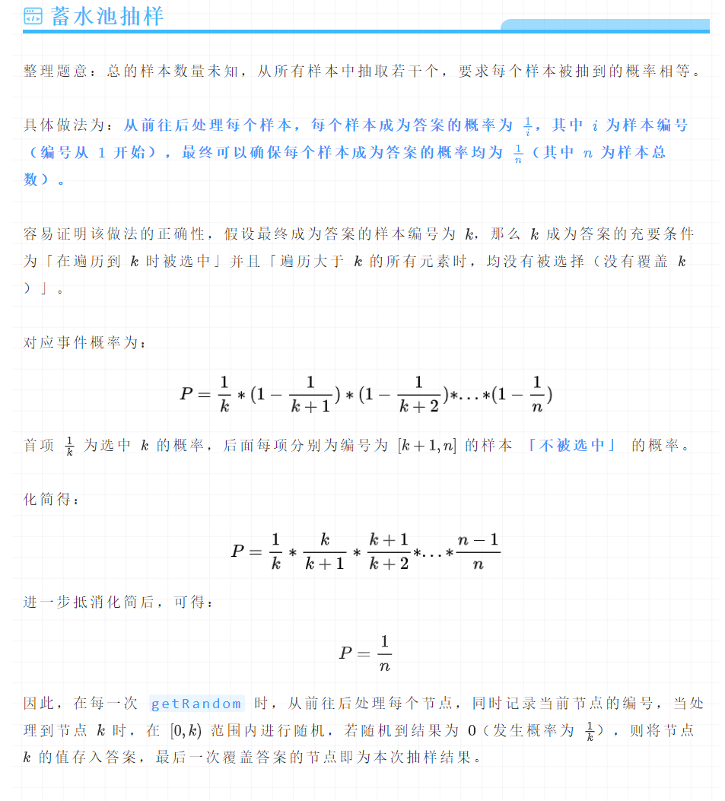

# 题目

## 1 **LC382. 链表随机节点**

给你一个单链表，随机选择链表的一个节点，并返回相应的节点值。每个节点 **被选中的概率一样**。

实现 `Solution` 类：

- `Solution(ListNode head)` 使用整数数组初始化对象。
- `int getRandom()` 从链表中随机选择一个节点并返回该节点的值。链表中所有节点被选中的概率相等。

## 2 LC398. 随机数索引

给你一个可能含有 重复元素 的整数数组 nums ，请你随机输出给定的目标数字 target 的索引。你可以假设给定的数字一定存在于数组中。

实现 Solution 类：

Solution(int[] nums) 用数组 nums 初始化对象。
int pick(int target) 从 nums 中选出一个满足 nums[i] == target 的随机索引 i 。如果存在多个有效的索引，则每个索引的返回概率应当相等。


# 算法思路

 

# 解题

关键在于，ans并非只更新一次。而刚开始idx=1保证了我们的ans至少会是第一个正确答案。


## LC382 链表随机节点

```cpp
class Solution {
public:
    ListNode* head;
    Solution(ListNode* _head) {
        head = _head;
    }
    int getRandom() {
        int ans = 0, idx = 0;
        auto t = head;
        while(t != NULL){
            idx++;
            if(rand() % idx == 0) ans = t->val;
            t = t->next;
        }
        return ans;
    }
};
```

## LC398 随机数索引

```cpp
class Solution {
    vector<int> &nums;
public:
    Solution(vector<int> &nums) : nums(nums) {}

    int pick(int target) {
        int ans;
        for (int i = 0, cnt = 0; i < nums.size(); ++i) {
            if (nums[i] == target) {
                ++cnt; // 第 cnt 次遇到 target
                if (rand() % cnt == 0) {
                    ans = i;
                }
            }
        }
        return ans;
    }
};
```

