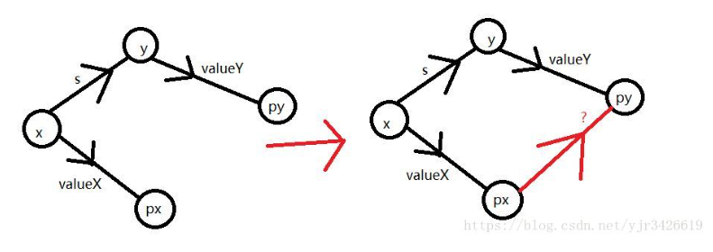

# 普通并查集

核心思想就是，**用一个元素来代表整个集合** ，所有涉及到集合的union(合并) 查找 都可以采用并查集技术

需要注意的几点:

* fa[i] = i  初始化
* find的路径压缩模板

```cpp
int findfa(int x){
    if(x == fa[x]) return fa[x];
    else return fa[x] = findfa(fa[x]);
}
```

* merge的模板

```cpp
void merge(int x, int y){
    fa[findfa(x)] = findfa(y);
}
```

牢记原则，我们是对代表集合的元素进行merge的，所以操作的对象一定是findfa(x)和findfa(y)，只要涉及到x和y本身的就考虑是不是写错了

**裸的例题：**

**P1111 修复公路**

**P3958 奶酪**

# 种类并查集

普通的并查集维护的关系是，亲戚的亲戚一定是亲戚

而种类并查集建立在可传递性的基础上，例如敌人的敌人就是朋友，食物的天敌就是同类

具体做法是开多倍并查集，**i + N 代表了元素 i 的敌人/天敌等特定关系集合的代表元素，** 当 j 与 k 都与 i+N merge时，根据可传递性关系，那么可以认为j 和 k 是这种意义上的朋友/同类

**例题：**

**P1525 关押罪犯**

**P2024 食物链**


# 带权并查集

有时候我们不仅想知道该元素是否在集合里，还想知道别的因素（一般为该元素距离祖先的距离），那么就会维护一个dis数组，并在find和merge时进行更新

【dis代表的是**与父节点的权值，而非是与祖先节点的权值**，否则路径压缩时就没必要进行更新了】

find时由于路径压缩，自己的祖先最终可能会变成最古老的祖先，所以需要提前记录，然后 dis[i] += dis[原祖先]

merge时根据四边形原则

 

```cpp
		int px = find(x);
		int py = find(y);
		if (px != py)
		{
			parent[px] = py;
			value[px] = -value[x] + value[y] + s;
		}
```

**例题：**

**P1196 银河英雄传说** 