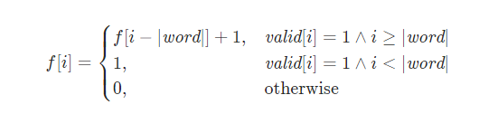

# 题目

查找一个字符串s1中，出现字符串s2连续出现的次数

# 思路

朴素，枚举每个位置，向后查找

dp，dp[i]代表了以i为尾，满足条件的个数。 

那么有

 


dp和朴素的枚举相比，就是多了一个记录，减少了重复的计算，空间换时间

# 代码

```c++
class Solution {
public:
    int maxRepeating(string sequence, string word) {
        int n = sequence.size(), m = word.size();
        if (n < m) {
            return 0;
        }

        vector<int> f(n);
        for (int i = m - 1; i < n; ++i) {
            bool valid = true;
            for (int j = 0; j < m; ++j) {
                if (sequence[i - m + j + 1] != word[j]) {
                    valid = false;
                    break;
                }
            }
            if (valid) {
                f[i] = (i == m - 1 ? 0 : f[i - m]) + 1;
            }
        }
        
        return *max_element(f.begin(), f.end());
    }
};

作者：LeetCode-Solution
链接：https://leetcode.cn/problems/maximum-repeating-substring/solution/zui-da-zhong-fu-zi-zi-fu-chuan-by-leetco-r4cp/
来源：力扣（LeetCode）
著作权归作者所有。商业转载请联系作者获得授权，非商业转载请注明出处。
```

